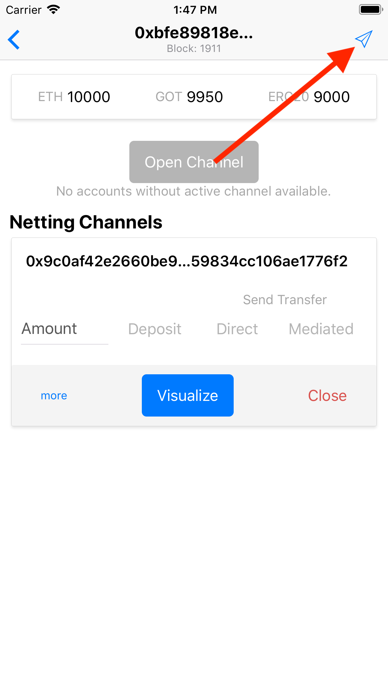
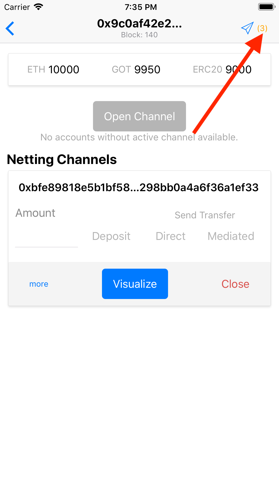
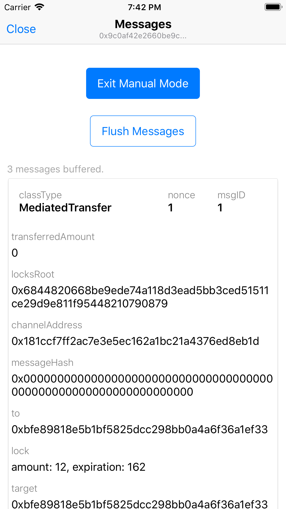

# Manual Messaging Mode

To provide a way of testing unreliable network conditions, the application implements messaging manual mode. To enter manual mode you need to tap on the message icon (top-right) from account's detail view and then tap `Enter Manual Mode` button.

When manual mode is active all outgoing messages will be buffered and their details displayed.

The number of buffered messages is displayed next to the message icon.

User needs to manually `Flush Messages` in order to actually send the messages. Please keep in mind that messages are sent one by one, so it may take few moments before the last buffered message has been delivered. Exiting manual mode will automatically perform the flush operation.

