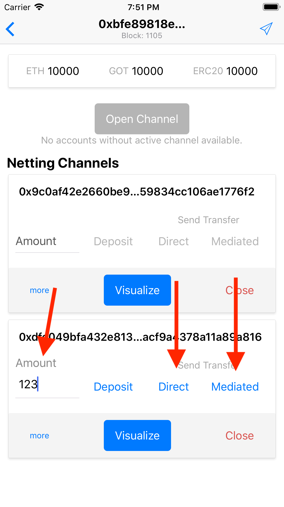
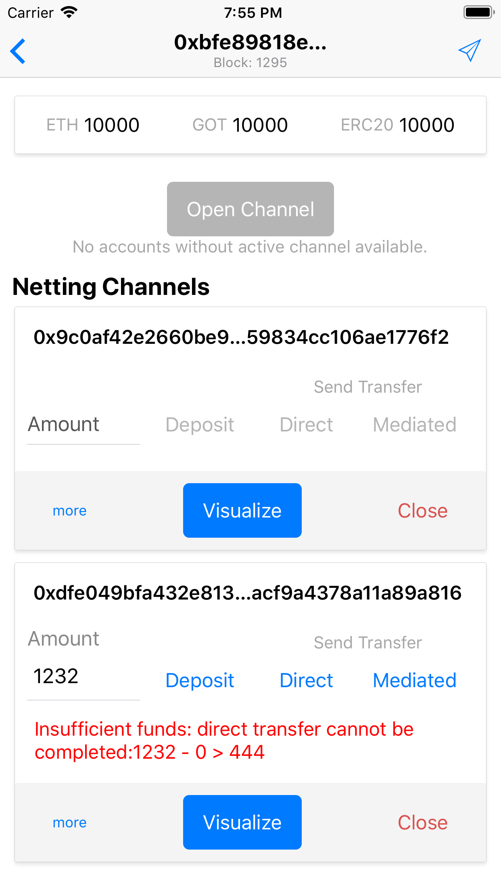
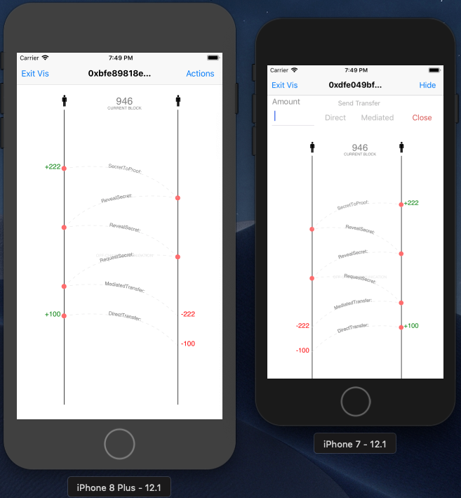

# Offchain Transfers

When a netting channel is in open state, user can send offchain transactions to the other peer. One need to specify amount and select transfer type direct / mediated.

  

In case of insufficient funds or other error conditions a detailed message is displayed.

  

One can open a visualization of peer to peer protocol, to have direct insight into the order of messages and exact moments funds are being transferred / locked.

  

