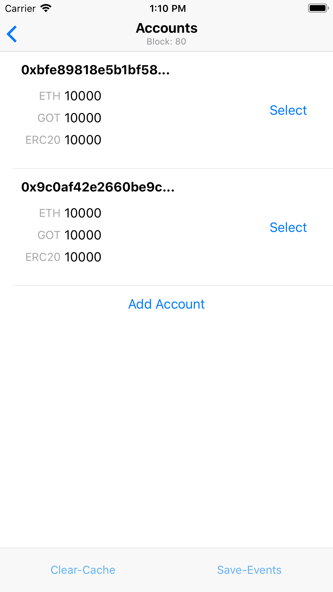

# Opening a Netting Channel

  

Starting in the main view, select an account. You should see account details view.

  

Tapping `Open Channel` button will let you allow to specify amount and select peer. Remember that you can have up to one active channel per peer.

  

Opening requires four blockchain operation. They need to be performed in a sequence. Status of each step is reflected in UI. During opening the UI is block.

  

Upon success you will be redirected to channel's details. And the newly opened channel will be visible on the list of all netting channels.

  

The changes to to netting channel lifecycle are reflected in the UI alongside set of possible actions.

In case no more peers without netting channel, the `Open Channel` button is inactive / grayed out.
