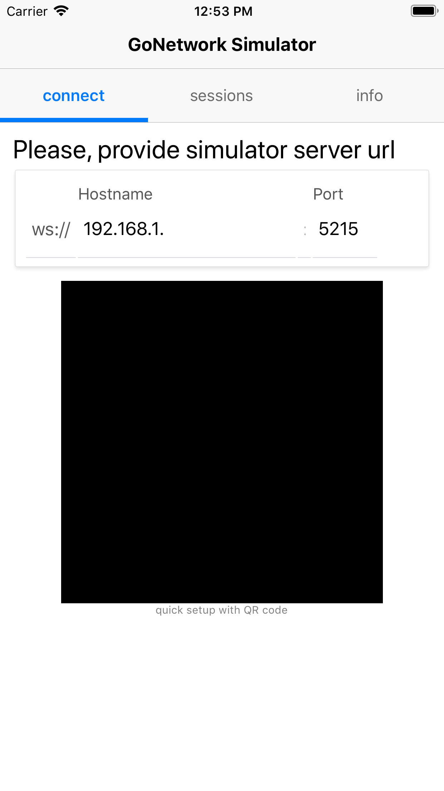
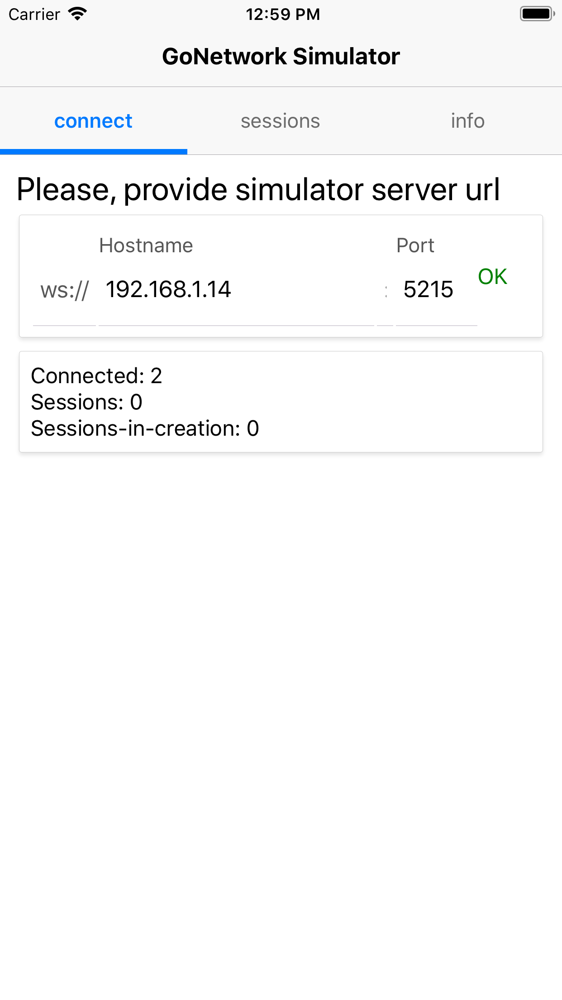
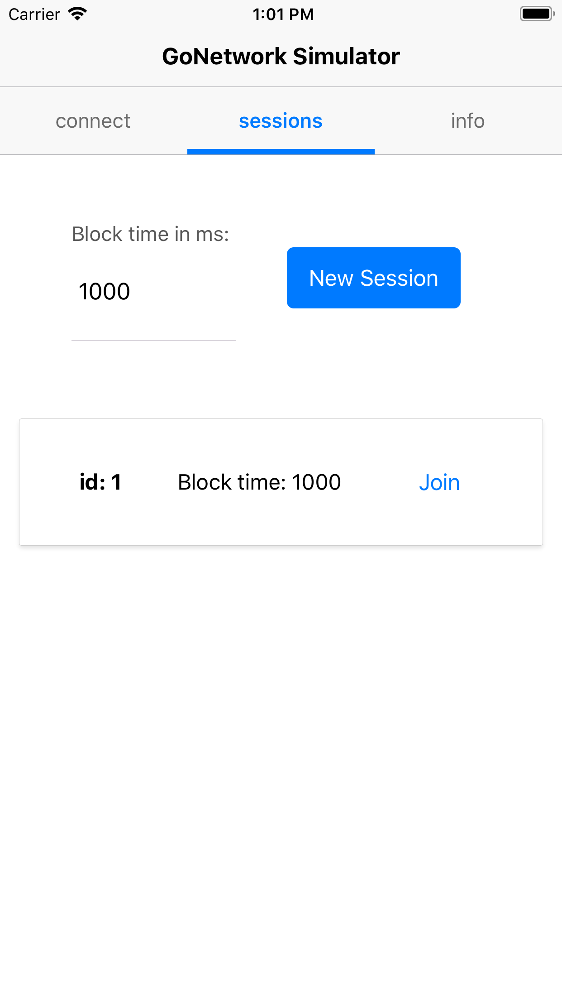
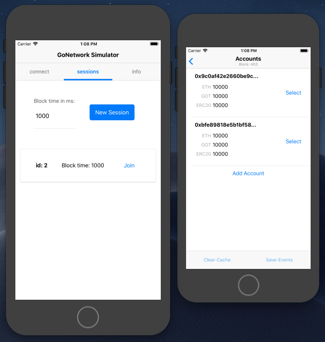

# Setup & Joining 

Once application started successfully you should be presented with initial screen.

  

You need to specify IP address of the coordination server - in case of local network it _may_ vary with time. Server prints out ip upon start. The app will be retrying to connect automatically to the server and success will be indicated in the UI. Some basic information about server state should be presented as well.

  

In the sessions tab you can either create a new session or join existing one.

  

By joining existing one from a different device you may imitating interactions from a multi user perspective.

  

Once in session you should be presented with a view with your accounts and option to create new ones.

  

